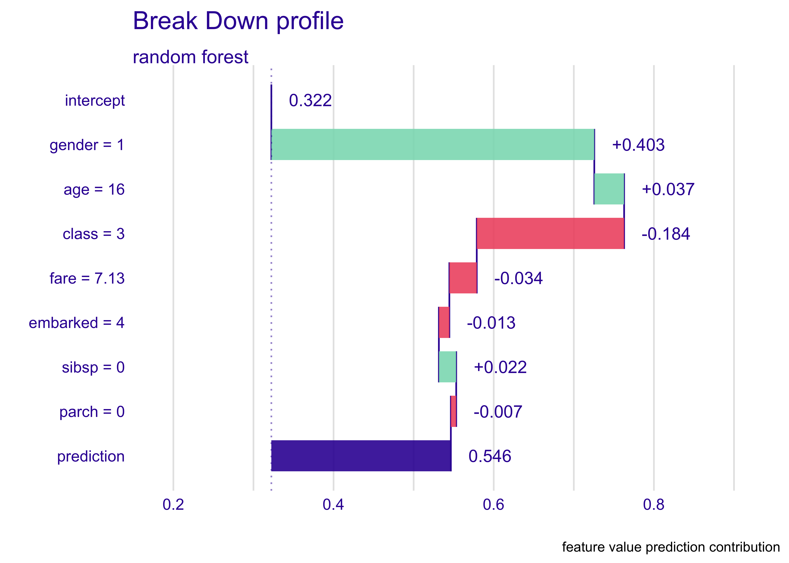
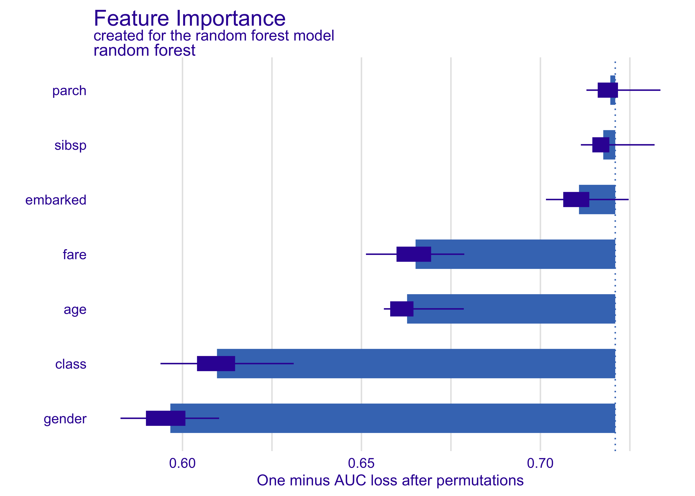
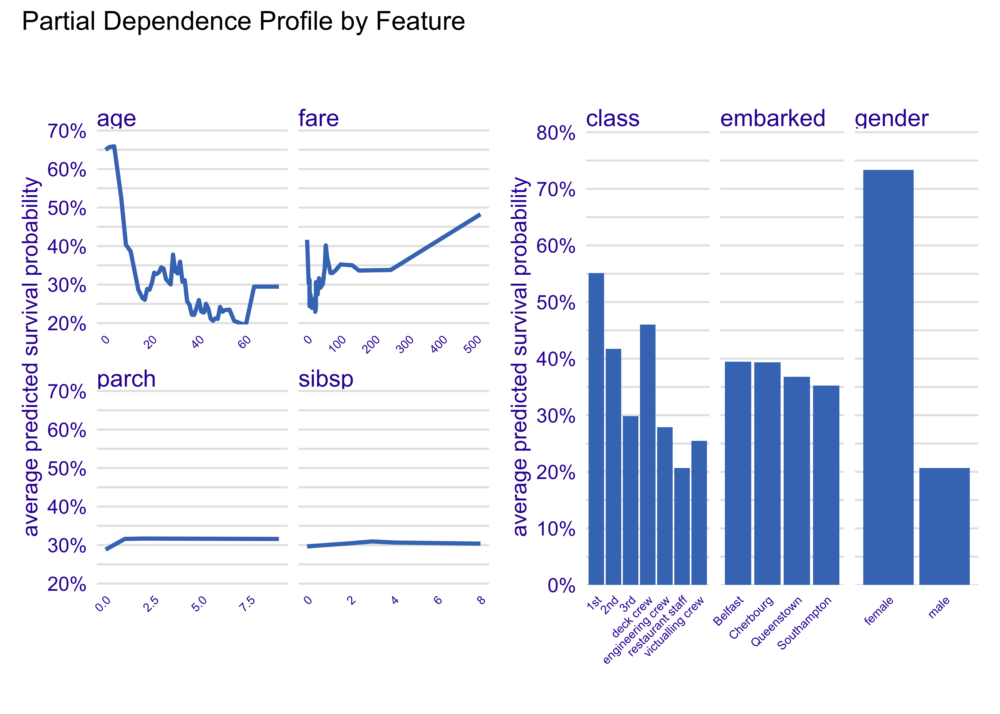
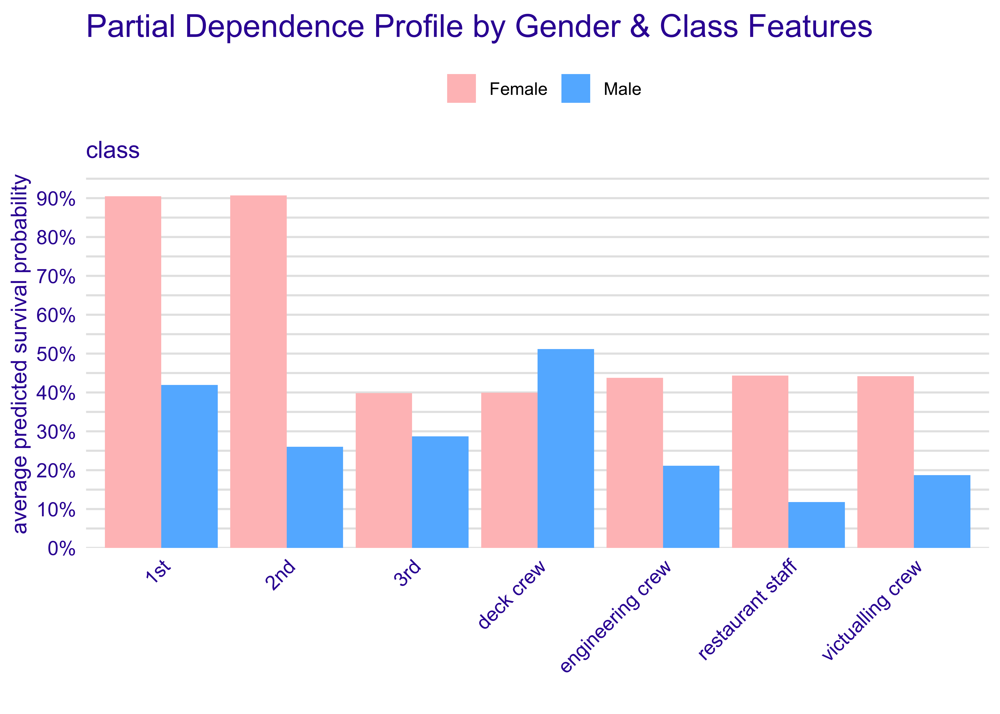

Explaining Tidymodels
================

### Overview

- Explore model explainability methods that can be used with tidymodel
  toolbox
- We can use model agnostic methods to provide transparency behind
  blackbox model predictions
- This notebook focuses on common approaches for local and global model
  explainability using the DALEX package
- Inspired by [Tidy Modeling with R: Ch 18 Explaining Models and
  Predictions](https://www.tmwr.org/explain.html)

``` r
options(scipen=999) 
library(tidyverse)
library(tidymodels)
library(ranger)
library(DALEX)
library(DALEXtra)
library(doParallel)
library(patchwork)
```

### Modeling Data

- predict Titanic survival

``` r
### use an imputed Titanic dataset from DALEX package
titanic_df <- DALEX::titanic_imputed %>%
      mutate(survived = factor(survived)) %>%
      as_tibble()

set.seed(543)
splits <- initial_split(titanic_df, strata = survived)
titanic_train <- training(splits)
titanic_test  <- testing(splits)

### 10 fold cross validation setup
set.seed(789)
titanic_train_folds <- vfold_cv(titanic_train, v = 10, repeats = 1, strata = survived)
```

### Train Random Forest Model

``` r
### set model engine and params to tune
rf_model <- 
  rand_forest(trees = 1000, 
              mtry = tune(), 
              min_n = tune(), 
              mode = "classification") %>%
  set_engine("ranger")

### model workflow
rf_wflow <-
  workflow() %>%
  add_formula(
    survived ~ .
  ) %>%
  add_model(rf_model)

### params to tune on using 10 fold cross validation
rf_params <- rf_model %>%
  extract_parameter_set_dials() %>%
  update(mtry = mtry(c(1, 7)))

### create tuning grid
tree_grid <- grid_regular(rf_params, levels = 4)

### parameter tuning
doParallel::registerDoParallel()
set.seed(8744)
rf_tune <- tune_grid(rf_wflow, 
                     resamples = titanic_train_folds, 
                     grid = tree_grid)

### selects best params for mtry and and min_n
rf_best_params <- select_best(rf_tune, "roc_auc")

### finalize model using top params
final_rf <- finalize_model(rf_model, rf_best_params)

### fit model on full training data
rf_fit <- fit(object = final_rf, 
              formula = survived ~ ., 
              data = titanic_train)
```

### Random Forest Model to Explain

- In practice, we’d explore various models, feature engineering methods,
  etc before jumping straight to explaining a “final” model

``` r
explainer_rf <- 
   explain_tidymodels(
     rf_fit, 
     data = titanic_train %>% select(-survived), 
     y = as.numeric(titanic_train$survived),
     label = "random forest"
   )
```

    ## Preparation of a new explainer is initiated
    ##   -> model label       :  random forest 
    ##   -> data              :  1655  rows  7  cols 
    ##   -> data              :  tibble converted into a data.frame 
    ##   -> target variable   :  1655  values 
    ##   -> predict function  :  yhat.model_fit  will be used (  default  )
    ##   -> predicted values  :  No value for predict function target column. (  default  )
    ##   -> model_info        :  package parsnip , ver. 1.0.3 , task classification (  default  ) 
    ##   -> predicted values  :  numerical, min =  0.00332688 , mean =  0.3223402 , max =  0.9996283  
    ##   -> residual function :  residual_function 
    ##   -> residuals         :  numerical, min =  0 , mean =  0 , max =  0  
    ##   A new explainer has been created!

### Local Model Explainability

- Used to assess which feature values are influencing an observation
  prediction most

### Example Observation to Explain Predicted Probability

``` r
example_observation <- titanic_df[5,]
example_observation
```

    ## # A tibble: 1 × 8
    ##   gender   age class embarked     fare sibsp parch survived
    ##   <fct>  <dbl> <fct> <fct>       <dbl> <dbl> <dbl> <fct>   
    ## 1 female    16 3rd   Southampton  7.13     0     0 1

### Break Down Method

- Measures how a feature value contributes to an observations overall
  model prediction
- In other words, starting at a mean prediction baseline (i.e. overall
  survival rate) does a feature value increase or decrease the predict
  probability of survival
- Feature ordering matters for non additive models (e.g. feature
  contributions can change when we pass features in different order to
  break down function)

##### Break Down Waterfall Context

- intercept: represents the overall survival rate in this example
- prediction: represents the predicted probability for the example
  observation

``` r
paste(
  "Training data overall survial rate", 
  scales::percent(mean(titanic_train$survived=="1"),.1)
)
```

    ## [1] "Training data overall survial rate 32.2%"

``` r
paste(
  "Example observation predicted survival probability", 
  scales::percent(
    predict(rf_fit, example_observation, type="prob")[,2] %>% pull(),.1
  )
)
```

    ## [1] "Example observation predicted survival probability 54.6%"

``` r
breakdown_rf <- predict_parts(explainer = explainer_rf,
                          new_observation = example_observation,
                          type = "break_down") #default
plot(breakdown_rf) +
  labs(caption = "feature value prediction contribution")
```



### SHAP Feature Value Contributions

- Take B different feature orderings and derive average contribution
  across the different combinations
- SHAP approach highlights gender, class, and fare as top feature values
  contributing to prediction vs break down method emphasizes gender and
  class as top contributing feature values

``` r
shap_rf <- predict_parts(explainer = explainer_rf,
                          new_observation = example_observation,
                          type = "shap",
                          B=25)
plot(shap_rf) +
  labs(title = "SHAP Contributions")
```


### Global Model Explainability

### Permutation Based Feature Importance

- For x feature, shuffle feature values and measure model performance
  impact/degradation
- Most important feature results in largest model performance drop when
  features values are shuffled
- Gender and class surface as most important features using feature
  value permutation method

``` r
rf_vip <- variable_importance(explainer_rf)
plot(rf_vip)
```



### Partial Dependence Plots

- Understand the marginal effect of a feature on the model prediction
- Categorical variables: observations take a given level and then
  predicted probabilities are averaged across all the observations
- Numeric variables: observations take a given value of the variable
  distribution and predicted probabilities are averaged across all
  observations

``` r
numeric_features <- titanic_train %>% select_if(is.numeric) %>% names()

pdps_num <- model_profile(explainer = explainer_rf, 
                           type = "partial", 
                           variables = numeric_features)

non_numeric_features <- 
  titanic_train %>% 
  select(-survived) %>%
  select_if(is.factor) %>% 
  names()

pdps_not_num <- model_profile(explainer = explainer_rf, 
                          type = "partial", 
                          variables = non_numeric_features)

p1 <- plot(pdps_num) +
  labs(title = "",
     subtitle = "",
     y="average predicted survival probability") +
  scale_y_continuous(labels = scales::percent_format(accuracy=1),
                     breaks = seq(0,1,.1),
                     expand = expansion(mult = c(0, .1))) +
  theme(axis.text.x = element_text(angle = 45, hjust = 1, vjust = 1, size=6))

p2 <- plot(pdps_not_num) +
  labs(title = "",
     subtitle = "",
     y="average predicted survival probability") +
  scale_y_continuous(labels = scales::percent_format(accuracy=1),
                     breaks = seq(0,1,.1),
                     expand = expansion(mult = c(0, .1))) +
  theme(axis.text.x = element_text(angle = 45, hjust = 1, vjust = 1, size=6))

p1 + p2 + plot_annotation(
  title = 'Partial Dependence Profile by Feature'
)
```



##### PDP Plot 2 Categorical Variable Interactions

- Future improvement idea: include some form of sample size or
  trustworthiness on this plot
- Warning: no female deck crew observations in analysis dataset
  (however, aggregate data point still shows up on this plot)

``` r
pdp_gender_and_class <- model_profile(explainer = explainer_rf, 
                      type = "partial", 
                      variables = c("class"),
                      groups = c("gender"))

plot(pdp_gender_and_class) +
  labs(title = "Partial Dependence Profile by Gender & Class Features",
     subtitle = "",
     fill = "",
     y="average predicted survival probability") +
  scale_y_continuous(labels = scales::percent_format(accuracy=1),
                     breaks = seq(0,1,.1),
                     expand = expansion(mult = c(0, .1))) +
  scale_fill_manual(labels = c("Female", "Male"), values = c("rosybrown1", "steelblue1")) +
  theme(axis.text.x = element_text(angle = 45, hjust = 1, vjust = 1, size=10))
```


\##### Example Accessing PDP Object for Custom Plot

``` r
pdp_age_and_gender <- model_profile(explainer = explainer_rf, 
                          type = "partial", 
                          variables = c("age"), 
                          groups = "gender",
                          # use all observations to generate aggregate profiles
                          N=NULL)

set.seed(543)
age_and_gender_plot_subset <- pdp_age_and_gender$cp_profiles %>%
  distinct(`_ids_`, gender) %>%
  group_by(gender) %>%
  sample_n(200)

pdp_age_and_gender$cp_profiles %>%
  ### limited sample of individual observations to plot
  filter(`_ids_` %in% age_and_gender_plot_subset$`_ids_`) %>%
  ggplot(aes(x = age,
             y = `_yhat_`,
             group = `_ids_`)) +
  geom_line(alpha=0.01) +
  geom_line(data = pdp_age_and_gender$agr_profiles,
            aes(x=`_x_`,
                group = `_label_`,
                color = `_label_`),
            size=4, alpha=0.85) +
  coord_cartesian(xlim = c(0, 75)) +
  scale_color_manual(labels = c("Female", "Male"), 
                     values = c("rosybrown1", "steelblue1")) +
  labs(title = "Partial Dependence Aggregate Profile
vs Individual Profile Sample Trends",
     subtitle = "",
     color = "",
     y="average predicted survival probability") +
  scale_y_continuous(labels = scales::percent_format(accuracy=1),
                     breaks = seq(0,1,.1),
                     expand = expansion(mult = c(0, .1)))
```


### Further Research

- Best practice to apply explainability methods on training data?
- Seems like different flavors of model explainability exist and domain
  context/use case might steer one to certain methods vs others
- Explore other methods/packages that play nice with the tidymodels
  ecosystem
